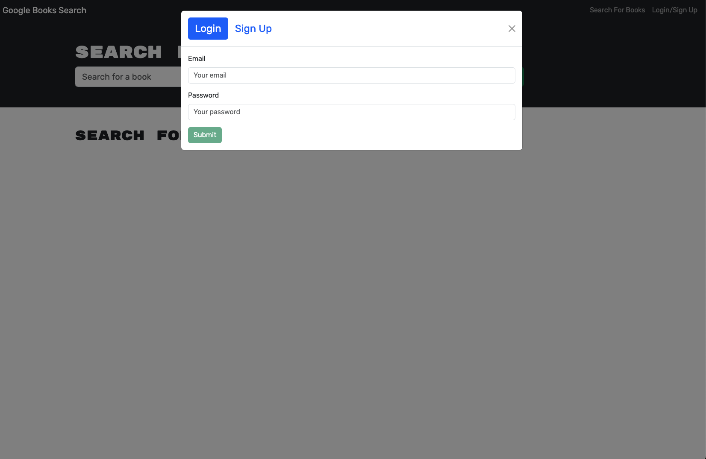
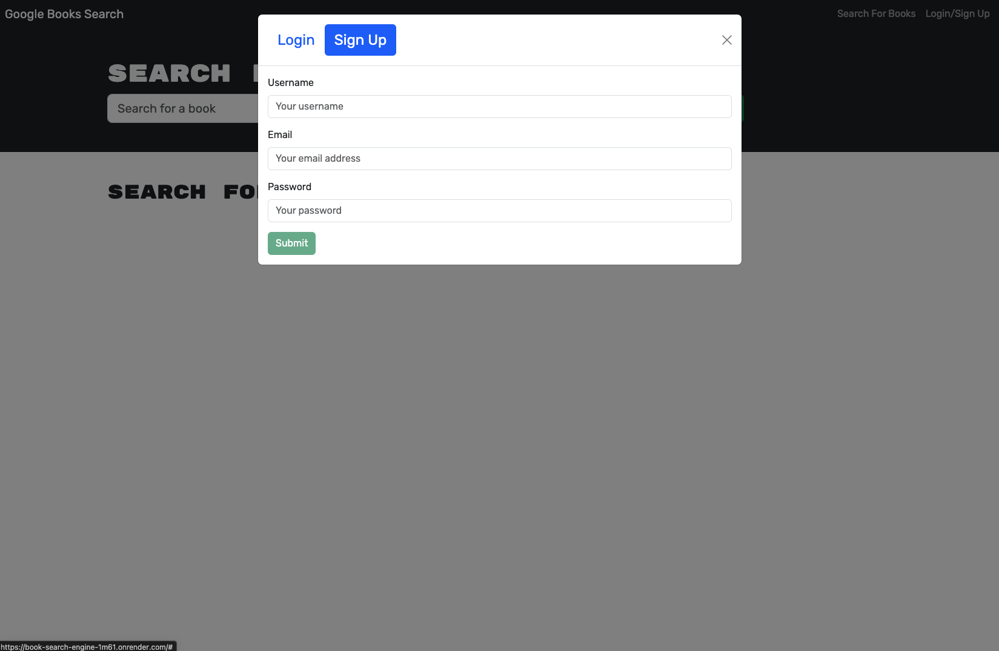
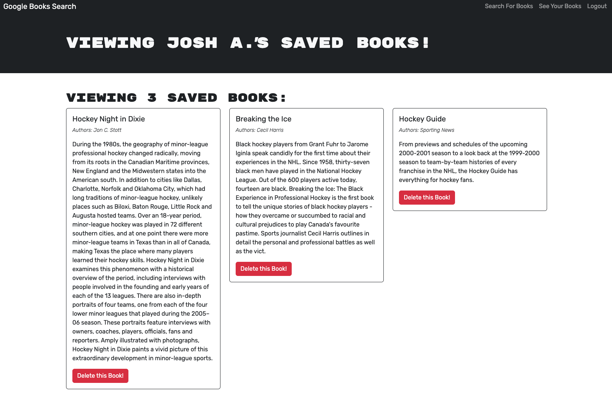

# Booke Search Engine

[](https://opensource.org/licenses/MIT)

## Description
This is a Book Search application that uses the Google Books API. Users can sign up, log in, and search and save books to their profile.

## Table of Contents
* [Installation](#installation)
* [Usage](#usage)
* [License](#license)
* [GitHub](#github)
* [Questions](#questions)

## Installation
#### If you want the code used to create this application:
1. **Clone the Repository**:
   Open your terminal and run the following command to clone the repository to your local machine:

   ```bash
   git clone git@github.com:JoshAskew/Book-Search-Engine.git

2. **Navigate to the Project Directory** :

    ```bash
    cd your-repo-name
3. **Install Dependencies**: 
    Make sure you have Node.js installed on your machine. If you haven't installed it yet, you can download it [here](https://nodejs.org/en).

    Then, install the required packages using npm:
    ```bash
    npm install
4. **Run the Application**: 
    You can now run the application by executing the following command:
    ```bash
    npm run start:dev
## Usage
This application is accessible in two ways:

1. **Locally**: Clone the repository, install the necessary dependencies, and run the application from the command line.
2. **Deployed Version**: Visit the live version of the application here: [Book-Search](https://book-search-engine-1m61.onrender.com/).


**Here, you can see what the Landing Page looks like when you open the application:**


**Here, you can see what the Login Page looks like:**


**Here, you can see what the Sign Up page looks like:**


**Here, you can see what the Saved Books page looks like:**


**Here, you can see what the Book Search page looks like:**


## License
This project is licensed under the MIT license.


* [License](https://opensource.org/license/mit)

## GitHub
**The contributors to this project are listed below. Click any name(s) to visit their GitHub page:** <br>
[Josh Askew](https://github.com/JoshAskew)


## Questions
If you have any questions reguarding this application, feel free to reach out to any of the contributors of the project. Contact info can be found on each individuals GitHub page (listed above).

## Credits and Acknnowledgements
- **University of Minnesota** — for providing foundational resources, guidance, and support throughout the development of this project.
- **[Node.js](https://nodejs.org/en)** — for its powerful runtime environment that allowed for efficient and scalable JavaScript development on the server side.
- **Vite** — for its fast and flexible build tool, which greatly enhanced our development workflow with rapid bundling and efficient hot reloading.
- **MongoDB** - for its robust and flexible NoSQL database that allowed us to store and manage data efficiently.
- **Mongo Atlas** - for providing a secure and cloud-based database service that simplified the deployment and scaling of our database.
- **Render** -  for offering an easy-to-use platform to deploy and host our application, ensuring reliable performance and uptime.
- **React** - for its powerful library that enabled the creation of dynamic and interactive user interfaces.

Thanks!